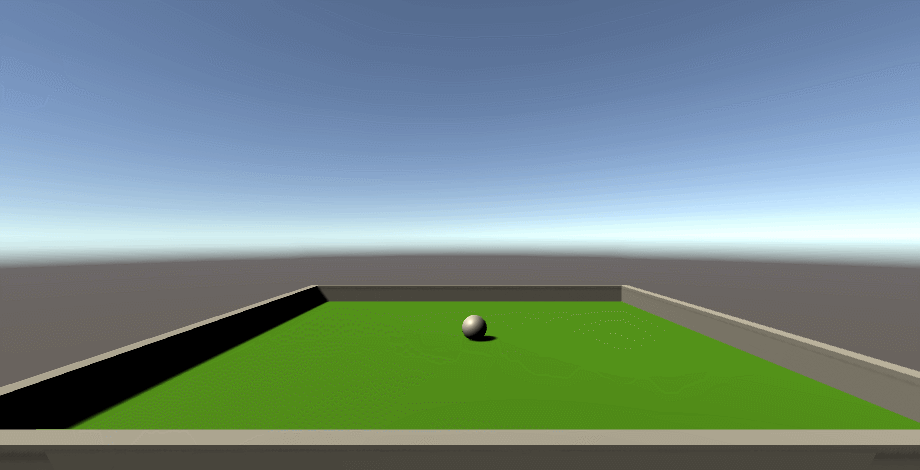

# Capture os pontos!

Um jogo simples em que o objetivo é capturar pontos com a bolinha.

## Como Jogar

Simplesmente use as setas para capturar os pontos e faça o máximo de pontos que conseguir!

## Prints do Jogo :
Manipulating the 3D scene, scripts and components :

  

  

## Video do Jogo :

  <video width="500" controls>
    <source src="Screenshots/video.mp4" type="video/mp4">
    

  </video>
## Explicação de Código :

A função Start() é um método especial em scripts do Unity que é chamado uma vez quando o objeto ao qual o script está anexado é inicializado. Aqui está o código da função Start() do script:

  
  
  rb = GetComponent<Rigidbody>();: Esta linha obtém o componente Rigidbody do GameObject ao qual este script está anexado e o armazena na variável rb. O Rigidbody é usado para aplicar física ao GameObject, como forças e colisões.
  count = 0;: Inicializa a variável count com o valor zero. Essa variável é usada para contar quantos pontos foram coletados.
  SetCountText();: Chama a função SetCountText() para atualizar o texto que exibe a contagem atual de pontos.
  winText.text = "Use as setas para começar a jogar";: Define o texto do objeto winText para informar ao jogador que ele deve usar as setas do teclado para começar a jogar.
  winText.gameObject.SetActive(true);: Garante que o objeto winText seja visível ao definir seu estado ativo como verdadeiro. Isso é importante para exibir mensagens ou instruções para o jogador.
  cibleInitialPositions = new Vector3[cibles.Length];: Inicializa o array cibleInitialPositions com o tamanho igual ao número de elementos no array cibles. Este array é usado para armazenar as posições iniciais das "Cibles".
  O loop for subsequente itera sobre o array cibles e armazena as posições iniciais de cada "Cible" no array cibleInitialPositions.
  

A função *OnTriggerEnter(Collider other)* é um método do Unity que é chamado quando outro Collider entra no Collider deste GameObject, desde que ambos os Colliders tenham a opção "Is Trigger" ativada.

  

  
    
  public void OnTriggerEnter(Collider other): Declaração do método que será chamado quando um Collider entrar no Collider deste GameObject.
  if (other.gameObject.CompareTag("Cible")): Verifica se o objeto que entrou no Collider é uma "Cible" (ou alvo), com base na tag atribuída ao objeto. As tags são usadas para identificar tipos específicos de GameObjects no Unity.
  other.gameObject.SetActive(false);: Desativa o GameObject da "Cible" que entrou no Collider, tornando-o invisível e desativando suas interações físicas.
  count++;: Incrementa a variável count, que representa o número de "Cibles" coletadas.
  SetCountText();: Chama a função SetCountText() para atualizar o texto que exibe a contagem atual de "Cibles" coletadas.
  if (count % 8 == 0): Verifica se o número de "Cibles" coletadas é um múltiplo de 8.
  StartCoroutine(ResetCiblesAfterDelay(1f));: Inicia a execução da coroutine ResetCiblesAfterDelay após 1 segundo (delay). Isso é feito usando StartCoroutine, que permite a execução de operações assíncronas (como atrasos) em scripts do Unity.
  
    
## Final :

  
